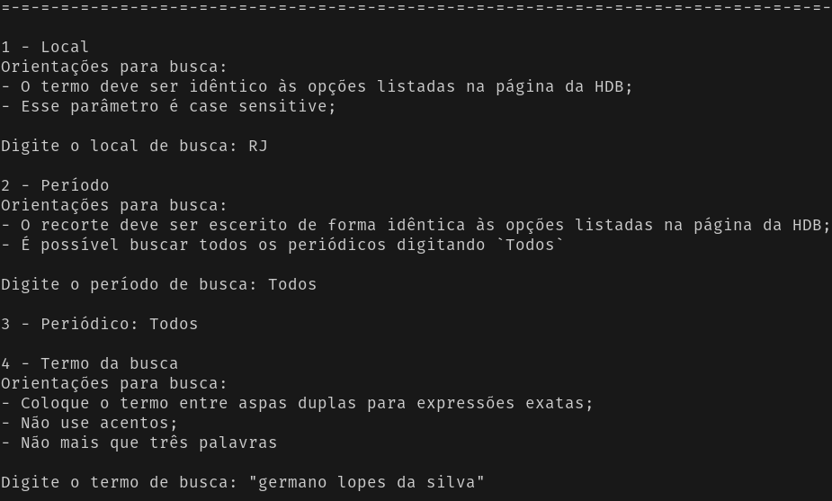
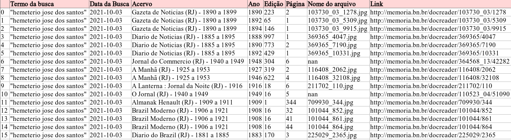

# `IMAGENS`

Imagens utilizadas no artigo.

---

## Figura 1: Print da tela de execução da pyHDB mostrando os parâmetros de busca utilizados no exemplo 1.

---

## Figura 2: Print de visualização do arquivo CSV com os dados da busca do exemplo 2, mostrando as dezesseis primeiras linhas e todas as colunas

---

## Figura 3: Tabela com a variação de valores absolutos e proporcionais de ocorrências nos 10 primeiros acervos. 

[Voltar para a página inicial](https://ericbrasiln.github.io/analise_pyHDB/)
